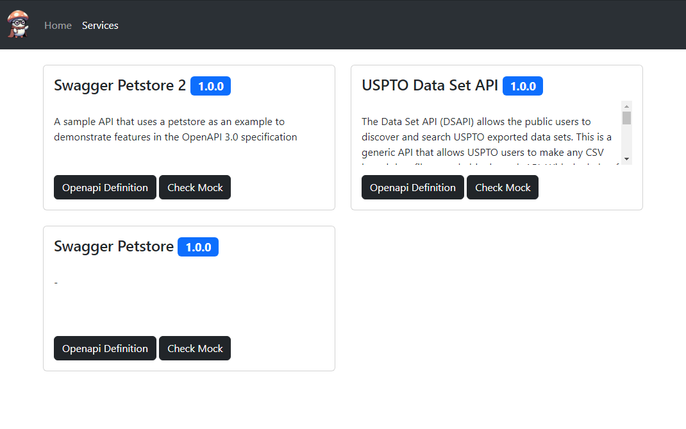
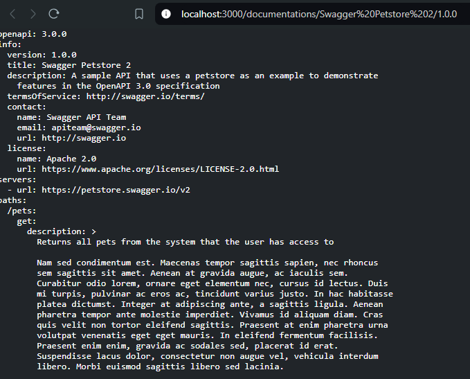
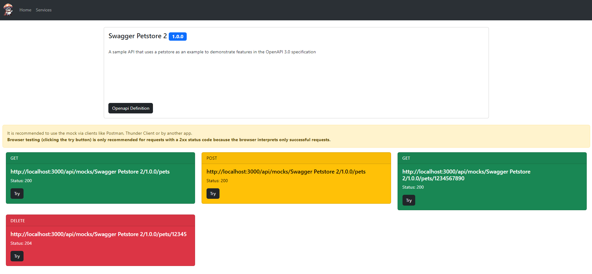
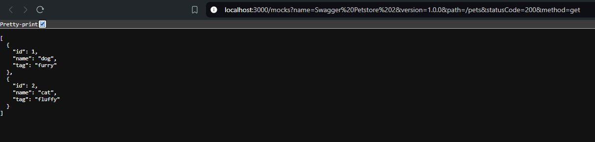

# SuperMockio


<center>
<h3>Hello! It's-a me, your API mock maker!</h3>

</center>


## What is SuperMockio ?
**SuperMockio** is a powerful tool designed to accelerate API development by generating mock backends directly from OpenAPI specifications. Whether you're an API designer, frontend or backend developer, or project manager.

SuperMockio empowers you to create realistic mock APIs for various use cases, such as client demos, decoupling frontend and backend development, or testing API integrations. 

**Key Features:**

* **Rapid Mock Creation:** Effortlessly generate mock backends from your OpenAPI contract.
* **Intelligent Data Generation:** Leverage defined examples or utilize AI-powered generation for accurate and realistic mock data.
* **Gemini AI Integration:** Benefit from advanced AI capabilities to enhance data generation.
* **Custom Status Code Header:** Using `X-SuperMockio-Status` custom header when sending a request to a mocked endpoint helps you get the desired response if the endpoint have multiple status code responses (example: 200, 404, 400, 500).

## Environment Variables
*: required
| Environment Variable | Description |
|---|---|
| MONGO_PROTOCOL* | Protocol for MongoDB connection can be either mongodb or mongodb+srv if using cloud mongodb instance |
| MONGO_USER* | Username for MongoDB connection |
| MONGO_HOST* | Hostname or IP address of MongoDB server |
| MONGO_PASSWORD* | Password for MongoDB connection |
| MONGO_DATABASE* | Name of the MongoDB database |
| AI_GENERATION_ENABLED | Flag to enable/disable AI generation |
| AI_SERVICE_NAME | Name of the AI service to use **(required if AI_GENERATION_ENABLED=true)** |
| GEMINI_API_KEY | API key for the Gemini AI service **(required if AI_SERVICE_NAME=gemini)** |
| ENABLE_UI | Flag to enable/disable the UI (default: false) |
| SUPERMOCKIO_URL | URL of the Supermockio server **(required if ENABLE_UI is true)** |

## Installation
### Docker
```bash
docker-compose up -d
```
### Local Dev
```bash
npm i
npm run start:dev
```

## Usage

### UI
> NOTE: You need to set the environment variable `ENABLE_UI` to `true` in order to activate the UI of SuperMockio

- You can check all the mocked services in the `services` section:
    <center>
    
    </center>

- By clicking on `Openapi Definition`, it will open a new tab that shows the openapi definition of the service:
    <center>
    
    </center>

- By clicking on `Check Mock`, it will shows you all the mocked endpoints of the selected service:
    <center>
    
    </center>
    We tried to follow the coloring convention of REST Methods to facilitate the navigation.

    For each endpoint you have the `full path`, `method` and `status code`

- You can test the mock by clicking on the `try` button:
    <center>
    
    </center>
    It works perfect with success status codes (2xx) with response body.

    For the rest since most of browsers throws errors when receiving error status codes.

    **That's why it's highly recommended to pass by clients like Postman or Thunder Client etc...**
### API
This is the recommended way to consume the mocks because it simulates a real use case. All mocks are accessible under `/api/mocks/serviceName/serviceVersion/*`.

For example you want to test a `GET` on `/pets` on your `Swagger Petstore` service with the version `1.0.0` :
```bash
curl -X GET \
  'localhost:3000/api/mocks/Swagger Petstore/1.0.0/pets'
```

If your operation has multiple status code responses, you can select the wished response by passing our custom header `X-SuperMockio-Status`
```bash
curl -X GET \
  'http://localhost:3000/api/mocks/USPTO Data Set API/1.0.0/oa_citations/v1/fields' \
  --header 'X-SuperMockio-Status: 404'
```
## Contributing
Contributions are welcome! Please open an issue or submit a pull request.

## License
